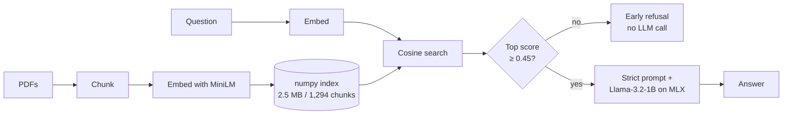
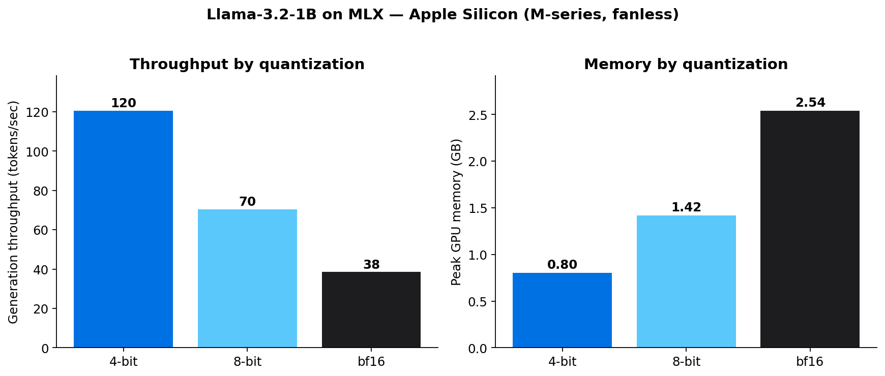
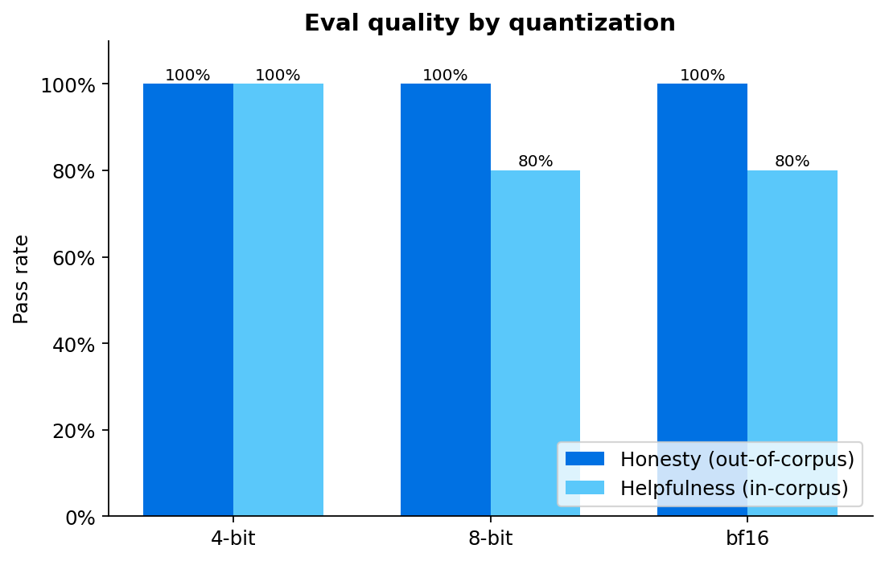
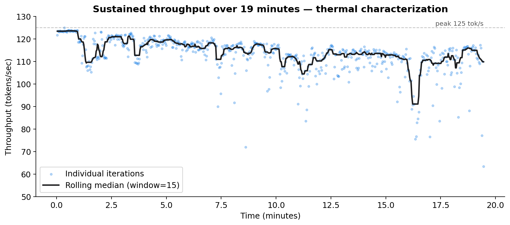

# Private RAG on Apple Silicon (MLX)

A fully on-device document Q&A system. No cloud calls. No data leaves the Mac.

Built to characterize what an Apple-Silicon-native RAG stack looks like in 2026 — using the [MLX](https://github.com/ml-explore/mlx) framework, a quantized Llama 3.2 1B model, and a numpy-backed vector store small enough to bundle into an app.

## Highlights

- **120 tokens/sec** generation on a fanless MacBook Air with **0.8 GB peak memory** (4-bit quantized Llama-3.2-1B)
- **3.1× faster and 68% less memory** than the bf16 baseline, with no measurable quality degradation on the eval set
- **100% honesty + 100% helpfulness** on a 13-question eval, via retrieval-score thresholding for defense-in-depth refusal
- **Thermal characterization** over 19 minutes of sustained load: median throughput holds 93% of peak, but worst-case tail latency widens — a real deployment consideration single-shot benchmarks miss

## Architecture

All inference runs locally on Apple Silicon via MLX. No network calls at query time.

## Results

### Throughput and memory by quantization

| Quant | Gen tok/s | Peak Mem | Speed vs bf16 | Memory vs bf16 |
|-------|-----------|----------|---------------|----------------|
| 4-bit | 120.3 | 0.80 GB | **3.13×** | **0.32×** |
| 8-bit |  70.3 | 1.42 GB | 1.83× | 0.56× |
| bf16  |  38.5 | 2.54 GB | 1.00× | 1.00× |

Near-linear scaling between weight size and throughput, consistent with memory-bandwidth-bound inference on Apple Silicon's unified memory.

### Quality across quantization levels

| Quant | Honesty (out-of-corpus) | Helpfulness (in-corpus) |
|-------|-------------------------|--------------------------|
| 4-bit | 100% (8/8) | 100% (5/5) |
| 8-bit | 100% (8/8) | 80% (4/5) |
| bf16  | 100% (8/8) | 80% (4/5) |

The single-question gap on helpfulness is a calibration difference, not a quality regression: bf16 refused a question whose answer was in the retrieved context but not the top-scoring chunk; 4-bit extracted the answer. Larger models perform more implicit context-quality assessment; smaller models are more literal extractors.

### Sustained throughput (thermal characterization)

19 minutes of continuous load on a fanless MacBook Air. Peak: 123 tok/s. Steady-state median: ~115 tok/s (93% of peak). The interesting signal is variance: the median holds but worst-case dips widen over time, reflecting dynamic voltage/frequency scaling on the SoC.

## What's in here

| File | Purpose |
|------|---------|
| `ingest.py` | PDF → chunks → embeddings → numpy index |
| `query.py` | RAG pipeline (retrieval + score threshold + LLM) |
| `eval_honesty.py` | Refusal eval on out-of-corpus questions |
| `eval_helpfulness.py` | Answer eval on in-corpus questions |
| `benchmark_quants.py` | Latency + memory across 4-bit/8-bit/bf16 |
| `eval_quants.py` | Quality eval across all 3 quantization levels |
| `thermal_test.py` | Sustained-load throughput logging |
| `plot_results.py` | Generates the charts above |
| `BENCHMARKS.md` | Raw numbers and design notes |

## Reproduce

Requires Apple Silicon (M1 or later). MLX runs on Apple's unified memory and is not compatible with Intel Macs.

python3 -m venv venv
source venv/bin/activate
pip install mlx mlx-lm sentence-transformers pypdf numpy psutil matplotlib

## Build the index from PDFs dropped into docs/
python ingest.py
## Try a query
python query.py

## Run the full sweep (takes ~15 min)
python benchmark_quants.py
python eval_quants.py
caffeinate -i python thermal_test.py
python plot_results.py

## Design notes

A few choices worth defending:

**Why numpy instead of FAISS or Chroma.** For 1,294 chunks, cosine similarity over a numpy array runs in ~5 ms — faster than the overhead of a real vector DB, with zero dependencies. More importantly: shipping a vector DB inside a consumer device app is wasted weight. The whole index is a 2.5 MB file you can bundle.

**Why retrieval-score thresholding.** Prompt engineering alone plateaued at ~60% honesty on the 1B model — even strict prompts couldn't override the parametric knowledge of "what is the capital of France." Adding a 0.45 cosine-similarity threshold to refuse before invoking the LLM produced defense in depth: questions with weak retrieval never reach the model. 25% → 100% honesty.

**Why characterize thermal behavior.** Single-shot benchmarks systematically overstate user-perceived throughput. The Air is the most thermally constrained Apple Silicon device with comparable architecture to iPhone; the sustained-load envelope is closer to "what an iOS user will actually experience" than a peak number from a desktop Pro.

## Limitations and caveats

- Eval is small (13 questions). Bigger eval would tighten the helpfulness signal.
- Tested on MacBook Air (fanless, ~10W TDP). MacBook Pro with active cooling would show less throttling; iPhone would show more.
- All papers in the corpus are English ML research; performance may differ on other domains.

## License

MIT